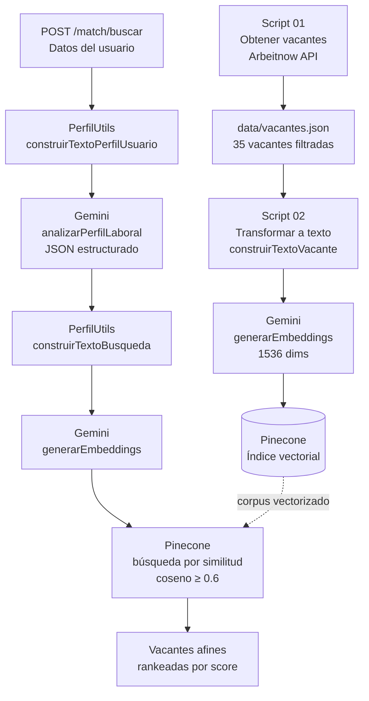

# MatchJobRAG

Sistema de matching de vacantes tecnológicas basado en RAG (**Retrieval-Augmented Generation**). Recibe el perfil de un estudiante de Ingeniería de Sistemas, lo analiza con Gemini, genera un vector de embedding y busca semánticamente en Pinecone las vacantes más afines.

> Proyecto de portafolio · Node.js · Google Gemini · Pinecone · Express

---

## Demo

> _Próximamente: GIF de la llamada al endpoint y respuesta con vacantes rankeadas._

Ejemplo de request y respuesta real:

**Request**
```json
POST /match/buscar

{
  "genero": "femenino",
  "edad": 21,
  "estudios": "Ingeniería de Sistemas en curso (6° semestre)",
  "orientacion": "backend",
  "experiencia": "proyectos académicos con Node.js y bases de datos",
  "habilidades": ["JavaScript", "Node.js", "SQL", "Git"]
}
```

**Response**
```json
{
  "perfil": {
    "area": "backend",
    "nivel": "practicante",
    "habilidades": ["JavaScript", "Node.js", "SQL", "REST APIs", "Git"],
    "resumenBusqueda": "Desarrolladora backend practicante con Node.js, SQL y APIs REST"
  },
  "vacantes": [
    {
      "score": 0.6812,
      "titulo": "Junior Backend Developer",
      "empresa": "TechCorp GmbH",
      "remoto": true,
      "tags": "Remote, Node.js, Software Development",
      "url": "https://www.arbeitnow.com/..."
    }
  ]
}
```

---

## Arquitectura



El sistema tiene dos fases independientes:
- **Fase offline** (scripts 01 y 02): se ejecuta una vez para poblar el índice vectorial con las vacantes.
- **Fase online** (API REST): se ejecuta en cada request del usuario para buscar en tiempo real.

---

## Stack

| Capa | Tecnología |
|---|---|
| Servidor | Node.js + Express 5 |
| IA — Análisis de perfil | Google Gemini (`gemini-3.5-flash-lite`) |
| IA — Embeddings | Google Gemini (`gemini-embedding-001`, 1536 dims) |
| Base de datos vectorial | Pinecone |
| Fuente de vacantes | Arbeitnow Public API |

---

## Retos técnicos resueltos

### 1. Alineamiento semántico entre consulta y corpus

El problema más importante de diseño en un sistema RAG no es el modelo de embeddings: es que el texto que se busca y el texto que se almacenó sean semánticamente comparables.

La solución fue que el texto de búsqueda (`construirTextoBusqueda`) se redacta intencionalmente como si fuera una descripción de vacante, no como una descripción del usuario:

```
# ❌ Lo que sería intuitivo pero incorrecto para búsqueda vectorial:
"Soy estudiante de backend con experiencia en Node.js y SQL..."

# ✅ Lo que permite comparar correctamente contra el corpus almacenado:
"Vacante orientada a perfil practicante en el área de backend.
Requiere conocimientos en: JavaScript, Node.js, SQL..."
```

Esto reduce la distancia coseno entre el query y los vectores almacenados, que también fueron indexados como descripciones de vacantes.

### 2. Pipeline de dos etapas con Gemini antes del embedding

En vez de convertir directamente el formulario del usuario en un embedding, se interpoló un paso con Gemini que extrae un perfil estructurado:

```
Datos en bruto del usuario
        ↓  Gemini (análisis de perfil)
{ area, nivel, habilidades[], resumenBusqueda }
        ↓  construirTextoBusqueda()
Texto optimizado para búsqueda vectorial
        ↓  Gemini (embedding)
Vector comparable con el corpus
```

Este paso intermedio normaliza la variabilidad del lenguaje humano (distintas formas de describir el mismo perfil) antes de entrar al espacio vectorial, reduciendo ruido en la búsqueda.

### 3. Calibración del umbral de similitud bajo restricciones de plan gratuito

El índice vectorial almacena solo 35 vacantes por la cuota del plan gratuito de Pinecone. Con un corpus tan pequeño, los scores de similitud coseno tienden a comprimirse: incluso las vacantes más afines raramente superan 0.75.

Un umbral inicial de `0.75` descartaba el 100% de los resultados. Se observaron los scores reales con logging en el controller y se calibró en `0.6`, que retiene coincidencias genuinas sin incluir resultados irrelevantes. Si el índice creciera a miles de registros, el umbral puede subirse.

### 4. Corpus multilingüe sin reentrenamiento

Las vacantes de Arbeitnow incluyen descripciones en inglés y alemán, pero los textos de búsqueda se generan en español. El modelo `gemini-embedding-001` maneja múltiples idiomas en el mismo espacio vectorial, pero la diferencia de idioma reduce artificialmente el score de similitud. La calibración del umbral absorbió esta penalización sin necesidad de traducción o procesamiento adicional.

---

## Instalación

```bash
# 1. Clonar el repositorio
git clone https://github.com/tu-usuario/MatchJobRAG.git
cd MatchJobRAG

# 2. Instalar dependencias
pnpm install

# 3. Configurar variables de entorno
cp .env.example .env
# Editar .env con tus claves
```

**Variables requeridas en `.env`:**
```
GEMINI_API_KEY=tu_clave_de_gemini
PINECONE_API_KEY=tu_clave_de_pinecone
PORT=3000
```

**Poblar el índice vectorial (solo la primera vez):**
```bash
node scripts/01-obtener_vacantes.js   # Obtiene y filtra 35 vacantes
node scripts/02-almacenar_vacantes.js # Genera embeddings y los sube a Pinecone
```

**Iniciar el servidor:**
```bash
node index.js
```

---

## Estructura del proyecto

```
MatchJobRAG/
├── scripts/
│   ├── 01-obtener_vacantes.js      # Fetch + filtrado de vacantes
│   └── 02-almacenar_vacantes.js    # Embedding y carga a Pinecone
├── utils/
│   ├── GeminiUtils.js              # Embeddings y análisis de perfil con Gemini
│   ├── PineconeUtils.js            # Operaciones sobre el índice vectorial
│   └── PerfilUtils.js              # Transformaciones de datos a texto semántico
├── controllers/
│   └── matchController.js          # Orquestación del pipeline de búsqueda
├── routes/
│   └── matchRoutes.js              # Definición de rutas HTTP
├── data/
│   └── vacantes.json               # Cache local de vacantes (generado por script 01)
├── docs/                           # Documentación técnica detallada
└── index.js                        # Entrada de la aplicación
```

---

## Lecciones aprendidas

**La calidad del texto importa más que el modelo.** El mismo modelo de embeddings puede dar resultados completamente distintos dependiendo de cómo se redacta el texto. Invertir tiempo en diseñar el formato del texto (tanto para el corpus como para la consulta) tiene más impacto que cambiar el modelo.

**En RAG, el umbral de similitud no es universal.** Depende del tamaño del corpus, del idioma, y de la distribución de los datos. Un valor tomado de un tutorial puede no funcionar en producción. Loggear scores reales y calibrar con datos propios es imprescindible.

**Un paso intermedio de LLM reduce el ruido antes del embedding.** Dejar que el usuario describa su perfil libremente y luego normalizar esa descripción con un LLM antes de generar el embedding produce búsquedas más consistentes que embeddings directos del texto del usuario.

**Las restricciones de infraestructura moldean las decisiones de diseño.** El límite del plan gratuito de Pinecone obligó a filtrar y seleccionar vacantes estratégicamente, lo que a su vez requirió calibrar el umbral de similitud. Las restricciones reales producen decisiones de diseño más interesantes que los proyectos sin límites.
